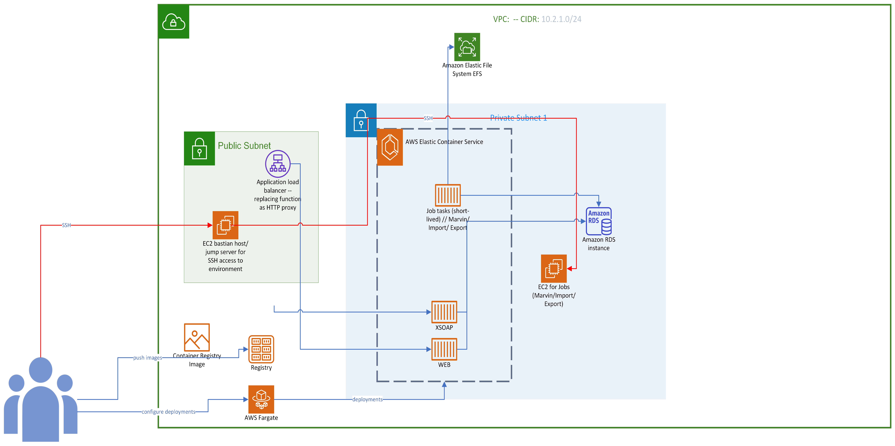

# AWS VPC Architecture with ECS Cluster and EFS Integration Using Terraform

This repository contains the Terraform configuration files to deploy a secure AWS VPC architecture that includes a public and private subnet, an ECS cluster running a GUI container and a SOAP container, an EFS shared volume, and a PostgreSQL database. The architecture is designed with a focus on security, scalability, and best practices for cloud infrastructure.

## Project Overview

- **VPC Configuration**: Custom VPC with public and private subnets deployed across two Availability Zones (AZs).
- **Bastion Host**: A secure bastion host in the public subnet that allows SSH access to cron_job host in the private subnet.
- **ECS Cluster (FARGATE)**: An ECS cluster that runs containerized applications, including a GUI and SOAP service.
- **EFS Integration**: Elastic File System (EFS) shared volume for persistent storage accessible by the ECS containers and the cron_job host.
- **PostgreSQL Database**: A PostgreSQL database running in the private subnet for data storage.
- **VPC Endpoints**: Access to Amazon ECR through VPC endpoints, eliminating the need for a NAT Gateway.

## Architecture Diagram

Below is the architectural diagram of the deployed infrastructure:



## Getting Started

### Prerequisites

- [Terraform](https://www.terraform.io/downloads.html) installed on your machine.
- AWS account with necessary permissions to create VPC, ECS, EFS, and RDS resources.
- AWS CLI configured with your credentials.

### Installation

1. **Clone the Repository**

   ```bash
   git clone https://github.com/matthewesosa/terraform-aws-secure-vpc-ecs.git
   cd terraform-aws-secure-vpc-ecs
